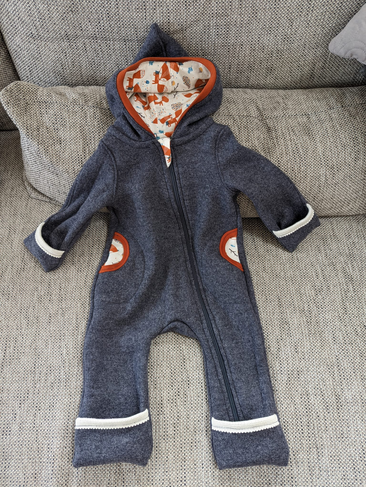
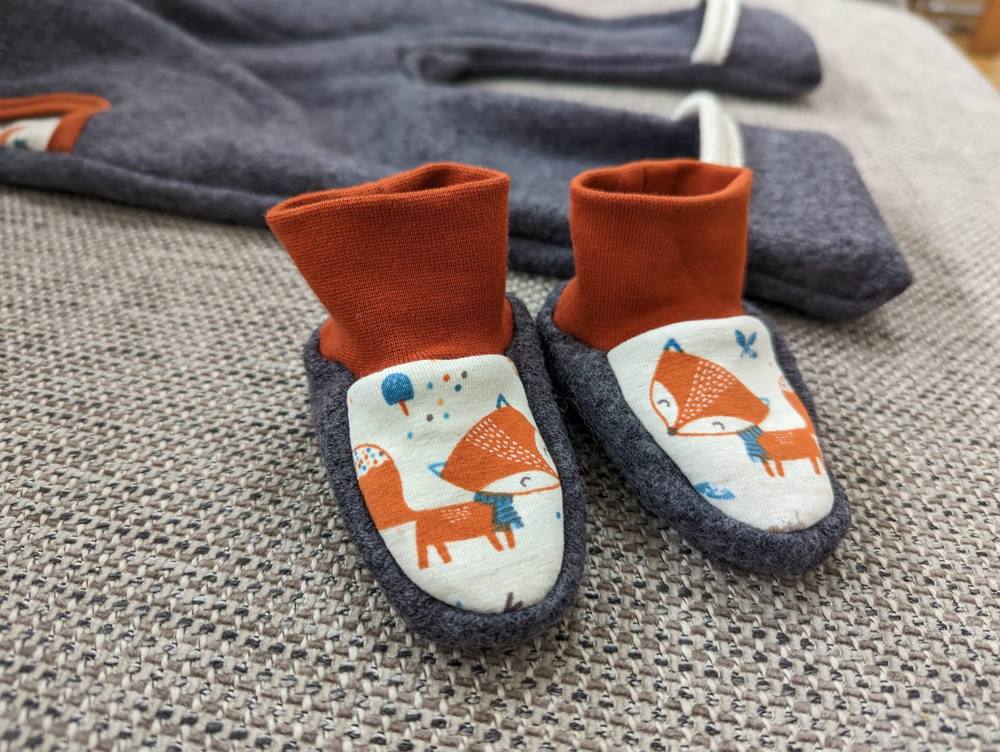
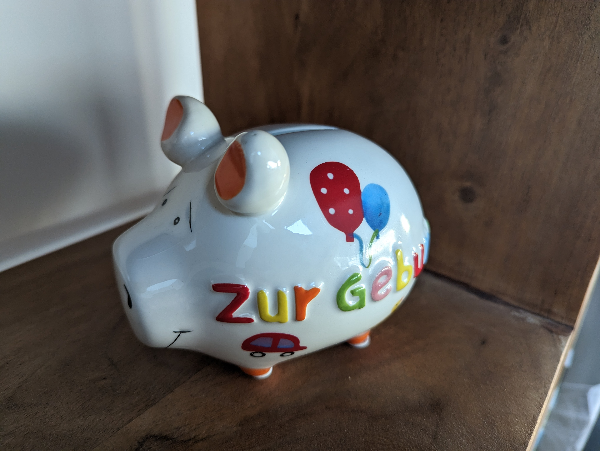

# project-baby

> Ein neugeborenes Baby ist wie der Anfang aller Dinge – es ist Staunen, Hoffnung, Traum aller Möglichkeiten.
> ~ Eda J. LeShan

Willkommen bei unserem Projekt Baby! :baby: Wir freuen uns, dass du mit uns mitfieberst!

Wir haben keine klassische Babyliste erstellt, da wir selbst noch gar nicht so konkrete Vorstellungen haben und mit einem eher minimalen Set an Dingen starten möchten. Deshalb haben wir uns statt einer klassischen Wunschliste bei Amazon für diese Übersicht entschieden. :wink: 

## Unsere Grundüberlegungen

<dl>
  <dt>Minimalistisch</dt>
  <dd>Mehr wird's sowieso immer von alleine. Und wir haben dankenswerter Freunde, die uns schon viel leihen und zur Verfügung stellen. :heart_eyes: Danke!</dd>
  <dt>Nachhaltig & Langlebig</dt>
  <dd>Kleidung und Möbel, die mitwachsen oder erweiterbar sind. Materialien/Produktionswege möglichst ökologisch mit fairen Arbeitsbedingungen.</dd>
  <dt>Gesund / Unbedenklich</dt>
  <dd>Geprüfte Materialien, die schadstofffrei und für Babies geeignet sind.</dd>
</dl>

## Du willst uns eine Freude machen?

Wir versuchen hier einen Überblick zu geben, was wir vor allem nicht brauchen und was nie verkehrt ist. Contributions im Repository sind erlaubt ;)
Im Zweifel könnt ihr gerne auch bei Lisi (elisabeth[punkt]floh[at]gmail[punkt]com) nachfragen um
- zu erfahren, ob wir etwas schon haben
- hier anonyme Änderungen erfassen zu lassen
- ihre Einschätzung zu Ideen zu bekommen 

### Was wir nicht brauchen

- Windeln in Größe 1
- Ratgeber/Bücher für (werdende) Eltern
- Schnuller / Schnullerketten
- Fläschchen o.ä.
- Pflegeprodukte für Baby & Mama

### Worüber wir uns sicher freuen

- [ ] Bücher zum Anschauen & Vorlesen
- [ ] Kleidung in späteren Größen, damit wir sie dann auch wirklich nutzen können (>68, angeblich passen 74 und 80 am längsten)
- [ ] Gutscheine für regionale Shops
- [ ] Gutscheine für die üblichen Notwendigkeiten (dm oder ähnliches)
- [ ] [Gutschein Trageberatung](https://www.xn--babysphre-12a.at/home/gutscheine-bestellen/) (werden wir in den ersten 2 Wochen nach Geburt machen)

...und natürlich freuen wir uns auch über Tipps & Tricks, Hinweise, was wir vergessen haben, und jedes Geschenk, das du dir überlegt hast :heart:

Wenn wir im Laufe der Wochen noch Konkreteres finden, was wir brauchen oder uns wünschen, werden wir es auch noch hier ergänzen.

## Stil

Wir lassen uns vom Geschlecht unseres Babies überraschen und wollen auch generell versuchen, Geschlechterstereotypen zu vermeiden. #farbensindfueralleda

Allgemein werden wir daher nicht überwiegend rosa/blau verwenden, und aufgrund persönlicher Vorliebe auch weniger gelb. Generell mögen wir es eher natürlich / freundlich und haben uns schon einiges im Bereich "Wald & Wiese" bzw. "Tiere" gefunden, was uns gefällt. Unten findet ihr auch ein paar Bilder was wir schon (geschenkt bekommen) haben - so könnt ihr euch auch einen Eindruck machen. ;)

Wie viele starten wir mit dem Vorsatz wenig Plastikspielzeug (vor allem anfangs nichts mit Batterien / Soundeffekten) und mehr Holz und werden sehen, wann der Vorsatz dann ad acta gelegt wird. 

### Was wir schon besitzen

#### Kleidung

    

#### Spielzeug

#### Sonstiges

#### Baby-/Kinderbücher

Folgende Bücher haben wir bereits in unserer Sammlung:

- Der kleine Siebenschäfer: Wie geht der Schluckauf wieder weg?
